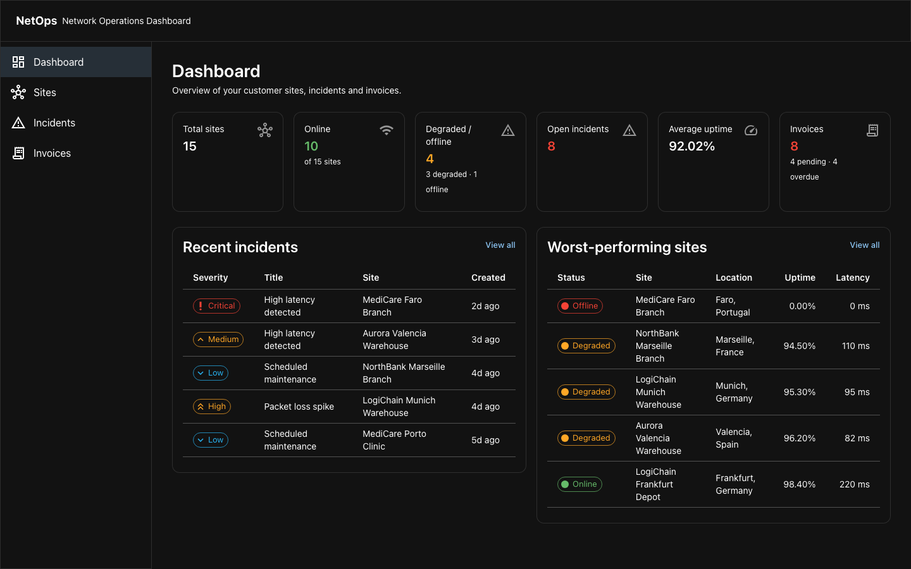
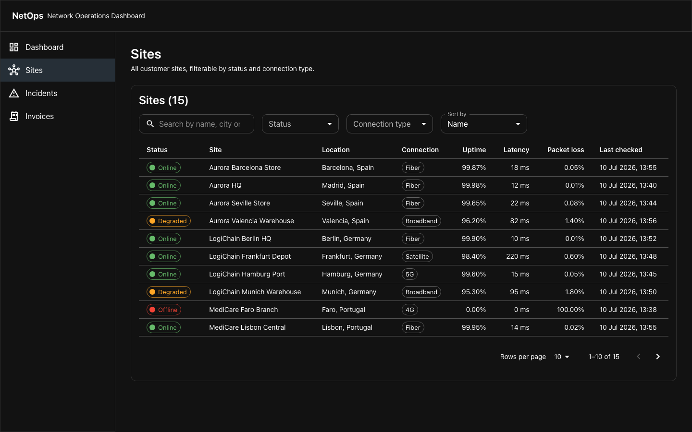
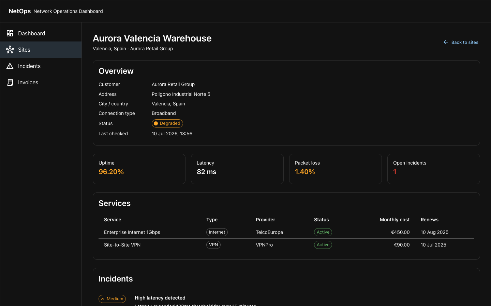
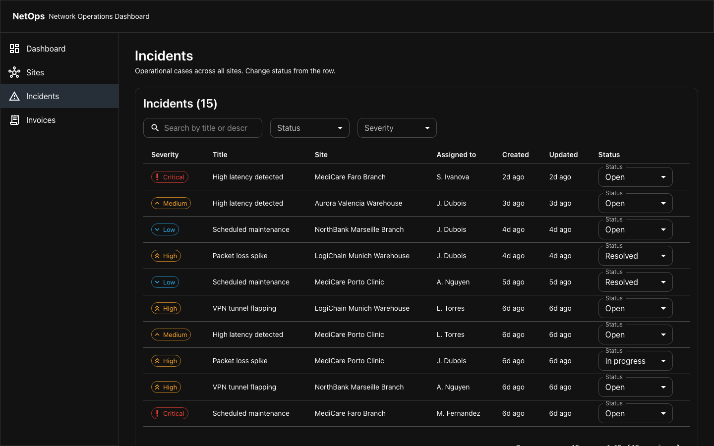
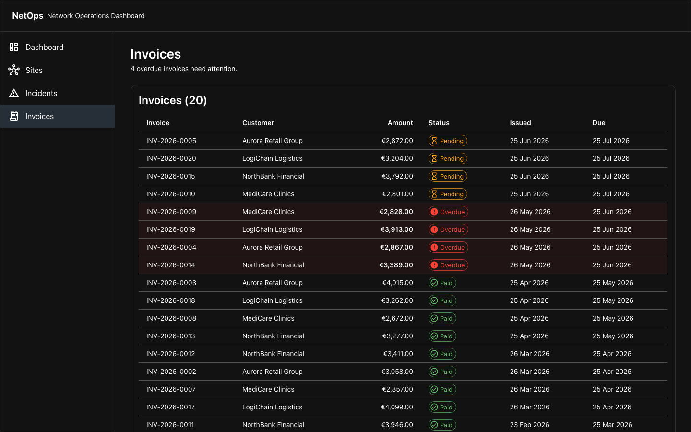

# NetOps — Network Operations Dashboard

A full-stack dashboard that simulates a customer-facing network operations platform for an enterprise connectivity provider. Users monitor customer sites, service status, incidents and invoices.

🛠️ React + Next.js + TypeScript on the front, C# / .NET 10 on the back, with a feature-based architecture, tests, accessibility and performance baked in.

---

## Screenshots

**Dashboard** — summary cards, recent incidents, worst-performing sites.



**Sites** — searchable, filterable list. URL is the source of truth for filters.



**Site detail** — overview + metrics + services + incidents timeline.



**Incidents** — filter, search and change status inline. Optimistic UI keeps the dashboard summary in sync.



**Invoices** — overdue rows tinted in red; the header highlights how many need attention.



---

## Table of contents

- [Why this project](#why-this-project)
- [Tech stack](#tech-stack)
- [Features](#features)
- [Architecture](#architecture)
- [Project structure](#project-structure)
- [API endpoints](#api-endpoints)
- [Running locally](#running-locally)
- [Running with Podman + Postgres](#running-with-podman--postgres)
- [Testing](#testing)
- [Storybook](#storybook)
- [Continuous integration](#continuous-integration)
- [Deployment](#deployment)
- [Accessibility](#accessibility)
- [Performance](#performance)
- [Security considerations](#security-considerations)
- [Interview walkthrough](#interview-walkthrough)
- [AI usage](#ai-usage)
- [Future improvements](#future-improvements)

---

## Why this project

Enterprise connectivity providers sell managed network services (internet, SD-WAN, VPN, firewalls) to multi-site customers. Operations teams need one place to answer:

- Which customer sites are online, degraded or down right now?
- Are there open incidents that need attention?
- What services does each site run, and when do they renew?
- What's the billing status across customers?

This project models that domain end-to-end so it can be used as a talking point in senior engineering interviews. The goal isn't a full product — it's to demonstrate:

- Strong frontend engineering with reusable components, typed contracts and clean feature-based architecture.
- Realistic API design with pagination, filtering, sorting and PATCH semantics.
- Handling of the four canonical UI states everywhere: loading, error, empty, success.
- Accessibility, performance and testing considered from the start, not bolted on.

---

## Tech stack

**Frontend**

- Next.js 16 (App Router) + React 19 + TypeScript
- Material UI 9 (with CSS variables, light / dark schemes)
- TanStack Query for server state (with `keepPreviousData` and optimistic updates)
- Vitest + React Testing Library + MSW for tests
- axe-core (via `vitest-axe`) for automated accessibility checks
- Storybook for the shared component library

**Backend**

- C# / .NET 10 (ASP.NET Core Web API)
- Entity Framework Core with SQLite for local dev (Postgres available via configuration)
- Swashbuckle for Swagger UI
- Deterministic seed data at startup

**DevOps**

- `podman-compose.yml` runs API + Postgres in containers (works with `docker compose` too)
- GitHub Actions CI: typecheck, lint, tests and build on every push and PR
- No auth, no cloud — everything works locally with zero external dependencies

---

## Features

**Dashboard** (`/dashboard`) — summary cards for total sites, online, degraded/offline, open incidents, average uptime and invoices. Recent incidents and worst-performing sites tables with quick links.

**Sites** (`/sites`) — searchable, filterable list. URL is the source of truth (`?search=paris&status=degraded&sortBy=uptime&page=2`). Debounced search, `keepPreviousData` for smooth pagination, MUI `TablePagination`, row-click to detail.

**Site detail** (`/sites/[id]`) — overview card + metrics + services table + incidents timeline. Three queries fetched in parallel, each with independent loading/error state.

**Incidents** (`/incidents`) — same URL-filter pattern. Row-level status dropdown with **optimistic updates**: the change is applied immediately in the UI; on error, the previous state is restored; on success, the dashboard summary is invalidated so the "open incidents" counter stays consistent.

**Invoices** (`/invoices`) — invoice list with overdue rows tinted in red and a chip-based status. The page header calls out overdue counts.

Every list page shows loading, error, empty and success states.

---

## Architecture

### Feature-based frontend

Each business area lives in its own slice (`src/features/<name>/`) with `types/`, `api/`, `hooks/` and `components/`. **Features never import from other features** — only from `shared/`. This keeps the boundaries clean and lets each slice evolve independently.

```
src/
├── app/                     Routing only (thin — pages compose feature components)
├── features/
│   ├── dashboard/
│   ├── sites/
│   ├── incidents/
│   └── invoices/
└── shared/
    ├── api/                 apiClient + ApiError
    ├── components/          Reusable UI (StatusBadge, DataTable, MetricCard, ...)
    ├── hooks/               useDebouncedValue, useUrlFilters
    ├── providers/           QueryProvider (TanStack Query)
    ├── theme/               MUI theme
    ├── types/               Domain enums + entity shapes
    └── utils/               Formatters + label maps
```

### State strategy

- **Server state** — TanStack Query. Query key factories per feature (`sitesKeys.list(filters)`) for granular invalidation. `staleTime: 30s`, `refetchOnWindowFocus: false`.
- **URL state** — filters live in the URL (`useSearchParams`). Shareable, bookmarkable, back-button works. A single `useUrlFilters` hook handles read/write with optional page reset.
- **Local UI state** — `useState` for open menus, hover, etc.
- **Derived state** — `useMemo` inside hooks; never stored.

### Backend layers

Thin controllers → services → EF Core → SQLite (or Postgres). DTOs are `record` types. Enum ↔ API string conversion is centralised in `Mapping/EnumMap.cs` so the wire format matches what the frontend expects (`"in_progress"`, `"4g"`, etc.).

```
NetOps.Api/
├── Domain/          Entities + enums
├── Data/            AppDbContext, DbSeeder, UtcDateTimeConverter
├── Dtos/            Request/response records
├── Mapping/         EnumMap + entity → DTO extension methods
├── Services/        DashboardService (composed queries)
├── Controllers/     Customers, Sites, Incidents, Invoices, Dashboard
└── Program.cs       DI, CORS, EF Core provider (Sqlite/Postgres), Swagger, seed on startup
```

### Notable decisions

- **`ConfigureConventions` + `UtcDateTimeConverter`** on the DbContext — SQLite loses `DateTimeKind`. All API timestamps go out with `Z`.
- **Enums stored as strings** (`.HasConversion<string>()`) — readable in the DB, resilient to enum reordering.
- **Manual mapping** (not AutoMapper) — less magic, clearer control flow.
- **Pagination baked in from day one** (`PagedResult<T>`) — the frontend can page without a server change.
- **`ActiveSitesCount` is computed, not stored** — never goes stale.

---

## Project structure

```
netops/
├── apps/
│   ├── api/              .NET 10 Web API (NetOps.Api)
│   └── web/              Next.js 16 frontend
├── podman-compose.yml    API + Postgres in containers
├── .gitignore
└── README.md
```

---

## API endpoints

| Method | Path | Notes |
|---|---|---|
| `GET` | `/api/dashboard/summary` | One-shot response for the whole dashboard |
| `GET` | `/api/customers` | Includes computed `activeSitesCount` |
| `GET` | `/api/customers/{id}` | |
| `GET` | `/api/sites` | Query: `search`, `status`, `connectionType`, `sortBy`, `sortDir`, `page`, `pageSize`. Returns `PagedResult<SiteSummary>` |
| `GET` | `/api/sites/{id}` | |
| `GET` | `/api/sites/{id}/services` | |
| `GET` | `/api/sites/{id}/incidents` | |
| `GET` | `/api/incidents` | Query: `status`, `severity`, `search`, `page`, `pageSize`. Returns `PagedResult<Incident>` |
| `GET` | `/api/incidents/{id}` | |
| `PATCH` | `/api/incidents/{id}/status` | Body: `{ "status": "in_progress" }`. Validates allowed values, updates `updatedAt` |
| `GET` | `/api/invoices` | |
| `GET` | `/api/invoices/{id}` | |

Swagger UI: `http://localhost:5102/swagger` when the API runs in Development.

---

## Running locally

Prerequisites: **.NET 10 SDK** and **Node.js 20+**.

### Backend

```bash
cd apps/api/NetOps.Api
dotnet run
```

- The API listens on `http://localhost:5102`.
- A local SQLite file (`netops.db`) is created and seeded on first run.
- Swagger UI at `http://localhost:5102/swagger`.

### Frontend

```bash
cd apps/web
npm install
npm run dev
```

- The frontend listens on `http://localhost:3000` and redirects `/` → `/dashboard`.
- API base URL comes from `NEXT_PUBLIC_API_BASE_URL` in `apps/web/.env.local` (defaults to `http://localhost:5102`).

---

## Running with Podman + Postgres

The project defaults to SQLite for zero-friction local dev, but the backend supports Postgres via configuration. The provided `podman-compose.yml` runs the **API + PostgreSQL** in containers. The frontend keeps running with `npm run dev` on the host (hot-reload is friendlier that way).

```bash
# with Podman
podman compose up --build

# or with Docker (same file works)
docker compose up --build
```

- API on http://localhost:5102 (Swagger UI at `/swagger`).
- Postgres on `localhost:5432` (user / password / database all `netops`).

The API image sets `Database__Provider=Postgres` and a matching connection string via environment variables. The same switch works locally without containers by setting these in your shell:

```bash
export Database__Provider=Postgres
export ConnectionStrings__Default="Host=localhost;Database=netops;Username=netops;Password=netops"
dotnet run
```

The provider selection lives in `Program.cs`:

```csharp
var provider = builder.Configuration["Database:Provider"] ?? "Sqlite";
if (provider.Equals("Postgres", StringComparison.OrdinalIgnoreCase))
    options.UseNpgsql(conn);
else
    options.UseSqlite(conn);
```

The frontend is left out of the compose file on purpose — Next.js dev with hot-reload is friendlier outside containers.

---

## Testing

```bash
cd apps/web
npm test              # single run
npm run test:watch    # watch mode
npm run test:coverage # v8 coverage
```

Setup: Vitest + jsdom + `@testing-library/react` + `@testing-library/user-event` + MSW.

The suite covers:

- **Unit** — `StatusBadge`, `SeverityBadge`, `MetricCard`, `EmptyState`, `ErrorState`, `PageHeader`, `SectionCard`.
- **Feature** — `SummaryCards` renders the six key metrics; `IncidentsFilters` fires the right callbacks; `SitesListView` renders API data, updates the URL on typing, filters by URL search term, and shows the error state on 500.
- **Accessibility** — `axe-core` via `vitest-axe` runs `toHaveNoViolations` on ten components. Failures block CI.

MSW intercepts real `fetch` calls in the test env, so the API layer, error handling and URL building are exercised, not mocked away.

---

## Storybook

The shared component library is documented in Storybook. It's used to develop and QA reusable pieces (`StatusBadge`, `SeverityBadge`, `MetricCard`, `EmptyState`, `ErrorState`, `LoadingSkeleton`, `SearchInput`) in isolation from the pages, and to catch a11y regressions early via the axe addon.

```bash
cd apps/web
npm run storybook          # dev on http://localhost:6006
npm run build-storybook    # static build to storybook-static/
```

Each component ships with an `autodocs` page (props table) plus stories for its main variants and states. The `@storybook/addon-a11y` panel runs axe on every story.

---

## Continuous integration

A GitHub Actions workflow (`.github/workflows/ci.yml`) runs on every push and PR to `main`:

- **Frontend** — install (`npm ci`), typecheck (`tsc --noEmit`), lint (`eslint`), test (Vitest + axe), build (Next.js).
- **Backend** — restore + build in Release configuration.

The two jobs run in parallel. `concurrency` cancels in-progress runs when new commits arrive on the same ref.

---

## Deployment

The project is currently designed to run locally — both from `dotnet run` / `npm run dev` and from `podman compose up` (see [Running with Podman + Postgres](#running-with-podman--postgres)). A live-hosted demo is deliberately out of scope for the portfolio version.

If you want to deploy it, the split is straightforward:

- **Frontend** — any Node-friendly host: Vercel (recommended for Next.js), Netlify, Cloudflare Pages, or self-hosted behind a reverse proxy. The only build-time config is `NEXT_PUBLIC_API_BASE_URL` pointing at a reachable API.
- **Backend** — anything that can run a .NET 10 container: Render, Railway, Fly.io, Azure Container Apps, AWS Fargate. The `Dockerfile` in `apps/api/NetOps.Api/` produces a runnable image with no extra work; supply `Database__Provider=Postgres` and `ConnectionStrings__Default` via env vars.
- **Database** — any managed Postgres (Neon, Supabase, Render Postgres, Cloud SQL). Point the API's connection string at it.

If you're only deploying the frontend and want to keep the demo interactive, the cleanest option is to run the API and Postgres locally with `podman compose up` while the deployed frontend points at a tunnelled URL (ngrok, Cloudflare Tunnel) — see the linked host's docs for details.

---

## Accessibility

- Semantic HTML: `<main>`, `<nav>`, `<section aria-label>`, `<time dateTime>`, `<ol>` for timelines.
- Status colours are always paired with icons and `aria-label` — colour is never the only signal.
- Focus visible ring in `globals.css`; MUI ripple isn't disabled.
- Loading states use `role="status" aria-live="polite" aria-busy="true"`.
- Error states use `role="alert"`.
- The sidebar link for the current section is marked with `aria-current="page"`.
- `DataTable` rows that are clickable are keyboard-activated with Enter/Space.
- Automated axe checks are part of the test suite.

---

## Performance

- **URL state instead of local state** — reloading a filtered page is instantaneous and shareable.
- **Debounced search** (300 ms) so typing doesn't hit the API on every keystroke.
- **`keepPreviousData`** in TanStack Query — pagination and filter changes don't flash a skeleton over the existing data.
- **Query keys factories** — invalidations are granular; changing an incident status only re-fetches the incidents list plus the dashboard summary.
- **Parallel fetches** on the site detail (site + services + incidents), each with its own loading state.
- **`React.memo`** on the two heaviest tables (`SitesTable`, `IncidentsTable`) so typing in the filter's search box doesn't force a table re-render until the debounced query returns.
- **`useSearchParams` wrapped in `<Suspense>`** in Sites and Incidents pages — required by Next 16 for pages that need to prerender statically.
- **Pagination baked in** — the API returns `PagedResult<T>` and the UI never renders more than the current page.

---

## Security considerations

This is a portfolio project without authentication, so the security surface is deliberately small. What was still done to keep the codebase honest for production-oriented review:

- **No secrets in the frontend.** The only frontend config is `NEXT_PUBLIC_API_BASE_URL`, which is a public URL by definition. Nothing sensitive is bundled with the client.
- **Environment-based configuration.** DB provider (`Sqlite` / `Postgres`) and connection string come from `appsettings.json` and environment variables; nothing is hardcoded to a specific deployment. The compose file passes them via `Database__Provider` / `ConnectionStrings__Default`.
- **Input validation at the API boundary.** The PATCH incident endpoint validates the status transition against the allowed enum values and returns a `400` with a clear message on invalid input.
- **CORS locked to known origins.** The API only allows `http://localhost:3000` (and its 127.0.0.1 equivalent) in Development; a production deployment would replace those with the real origin.
- **Timestamps normalised to UTC** at the DB boundary — prevents timezone-related bugs that can mask staleness or expiry checks.
- **`.gitignore` covers local secrets** — `.env.local`, `.env*.local`, `appsettings.Local.json`, `bin/`, `obj/`, `*.db` are excluded from source control.
- **Dependency scanning.** `npm audit` runs locally; CI runs `npm ci` (which respects the lockfile) and `dotnet build` on a pinned .NET SDK version.
- **Error messages don't leak internals.** `ErrorState` in the UI shows a friendly message and offers retry; the API returns RFC 7807 `ProblemDetails` shapes without stack traces in production.

Things that would need to be added for a real deployment (deliberately out of scope here):

- Authentication and RBAC (multi-tenant view for customers vs operators).
- CSP and other security headers configured at the edge / hosting layer.
- Rate limiting on the API.
- Secrets management (Azure Key Vault, AWS Secrets Manager or equivalent).
- Structured audit logging on state-changing endpoints (`PATCH /api/incidents/{id}/status`).

---

## Interview walkthrough

A good five-minute tour of the project:

1. **Dashboard** — explain the domain: an enterprise connectivity provider monitoring customer sites, incidents and invoices. Point at the summary cards, the recent incidents feed and the worst-performing sites list.
2. **Sites list** — show the filters and the URL. Bookmark or share a URL like `/sites?status=degraded&sortBy=uptime`; reload and prove the state survives. Call out the debounced search and `keepPreviousData` (no skeleton flash on page changes).
3. **Site detail** — click a row. Three queries fetched in parallel (site + services + incidents), each with its own loading state. No fetch waterfall.
4. **Incidents** — change a row's status. The UI updates immediately (optimistic), a small spinner shows the request in flight, and — critically — going back to the Dashboard shows the "Open incidents" counter has decremented. That's `updateTag`-style cache invalidation working end-to-end.
5. **Swagger** — open `http://localhost:5102/swagger` and walk the API surface. Highlight `PagedResult<T>`, the enum contract (`"in_progress"`, `"4g"`), and the validation on `PATCH /api/incidents/{id}/status`.

Total: ~5 minutes. Every click is a decision worth justifying.

---

## AI usage

AI tools were used to speed up scaffolding, explore implementation alternatives and generate first drafts of tests. All generated code was reviewed, adapted and validated manually. Architecture, contracts, state model, accessibility choices, testing strategy and performance decisions were driven by the developer, not by the tools.

---

## Future improvements

- Authentication and role-based access (multi-tenant view for customer users).
- Real-time updates via SignalR (site status changes, new incidents).
- Charts for historical uptime / latency.
- Playwright end-to-end tests covering the golden flows.
- xUnit tests for the backend (`DashboardService`, filter logic, PATCH validation).
- OpenAPI-driven type generation on the frontend to keep contracts in sync.
- EF Core migrations for production (currently `EnsureCreated` on startup for dev).
- Full CSP, rate limiting and centralised secrets management for a production deployment.
